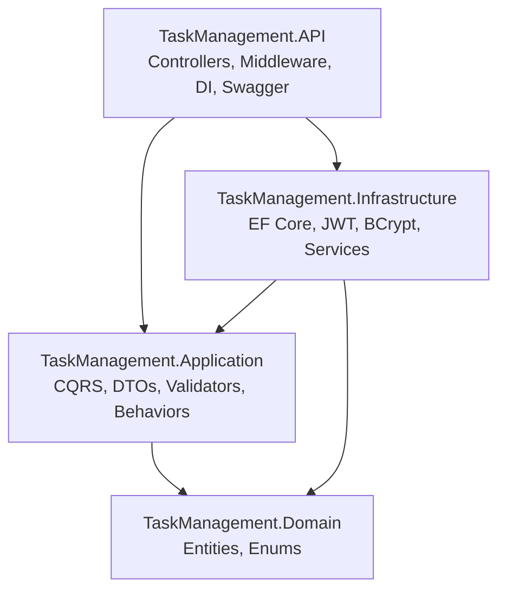
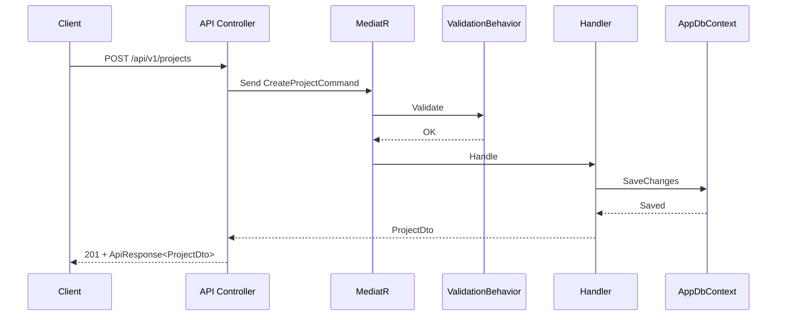
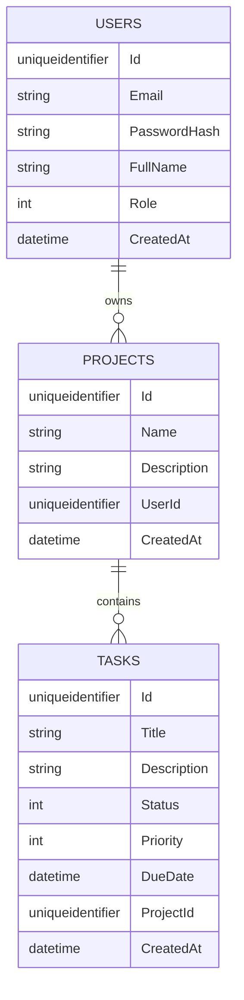

# Task Management API

A small, scalable backend for managing projects and tasks, built for a .NET backend technical assessment. The API follows Clean Architecture and uses CQRS with MediatR.

## Overview

This API lets users register, authenticate, and manage their own projects and tasks. All write and read operations flow through MediatR handlers, and the API surface is versioned under `/api/v1`.

## Architecture

The solution is split into four projects:

- **TaskManagement.Domain**: Entities and enums only (no framework dependencies).
- **TaskManagement.Application**: CQRS handlers, DTOs, validation, and interfaces.
- **TaskManagement.Infrastructure**: EF Core persistence, JWT, BCrypt, and concrete services.
- **TaskManagement.API**: Controllers, middleware, Swagger, and composition root.

Dependency rule: `API -> Application -> Domain` and `Infrastructure -> Application -> Domain`. The application layer never references infrastructure types directly.

### Architecture diagrams

Layered dependencies:



Request flow (create project):



Data model (simplified):



### Folder map

```
src/
  TaskManagement.API/
  TaskManagement.Application/
	Common/ (ApiResponse, exceptions, behaviors)
	Features/ (Auth, Projects, Tasks)
	Interfaces/ (IAppDbContext, IJwtTokenGenerator, ...)
  TaskManagement.Infrastructure/
	Auth/ (JWT, BCrypt)
	Persistence/ (DbContext, configurations, migrations)
	Services/ (CurrentUserService)
  TaskManagement.Domain/
	Entities/ (User, Project, TaskItem)
	Enums/ (UserRole, TaskItemStatus, TaskPriority)
```

## Tech stack

- .NET 9, ASP.NET Core Web API
- Entity Framework Core + SQL Server
- JWT authentication (custom user table + BCrypt)
- MediatR + CQRS, FluentValidation
- Swagger + API versioning
- xUnit, Moq, FluentAssertions
- Docker (multi-stage API image, compose with SQL Server)

## Requirements

- .NET 9 SDK
- SQL Server (local instance) or Docker
- Optional: `dotnet-ef` tool for applying migrations

Install EF tools if needed:

```bash
dotnet tool install --global dotnet-ef
```

## Configuration

Defaults live in `src/TaskManagement.API/appsettings.json`. You can override them with environment variables.

Key settings:

- `ConnectionStrings__DefaultConnection`
- `JwtSettings__Secret`
- `JwtSettings__Issuer`
- `JwtSettings__Audience`
- `JwtSettings__ExpirationInMinutes`

Example environment overrides (Windows):

```bash
setx ConnectionStrings__DefaultConnection "Server=localhost;Database=TaskManagementDb;Trusted_Connection=true;TrustServerCertificate=true;"
setx JwtSettings__Secret "CHANGE-ME-use-a-long-secret-key-at-least-32-characters!"
```

Minimum JWT secret length: 32 characters.

## Local development

Restore and build:

```bash
dotnet restore
dotnet build
```

Apply migrations (from repo root):

```bash
dotnet ef database update -p src/TaskManagement.Infrastructure -s src/TaskManagement.API
```

If you prefer to create the database from scratch:

```bash
dotnet ef database drop -p src/TaskManagement.Infrastructure -s src/TaskManagement.API
dotnet ef database update -p src/TaskManagement.Infrastructure -s src/TaskManagement.API
```

Run the API:

```bash
dotnet run --project src/TaskManagement.API
```

Swagger UI:

- http://localhost:5245/swagger
- https://localhost:7258/swagger

## Docker

Build and run the API + SQL Server with Docker Compose:

```bash
docker compose up --build
```

Swagger UI:

- http://localhost:8080/swagger

Set a stronger password for SQL Server by exporting `SA_PASSWORD` before running compose:

```bash
setx SA_PASSWORD "YourStrong!Passw0rd"
```

## API basics

All endpoints are under `/api/v1`. Auth endpoints are public, everything else requires a bearer token.

### Response shape

All responses are wrapped in a consistent envelope:

```json
{
  "success": true,
  "data": { },
  "message": "Optional message",
  "errors": null
}
```

### Enum values

Enums are serialized as integers by default.

- `TaskPriority`: `0=Low`, `1=Medium`, `2=High`, `3=Critical`
- `TaskItemStatus`: `0=Todo`, `1=InProgress`, `2=Done`, `3=Cancelled`

### Endpoints

**Auth**

- `POST /api/v1/auth/register`
- `POST /api/v1/auth/login`

**Projects** (requires auth)

- `GET /api/v1/projects`
- `GET /api/v1/projects/{id}`
- `POST /api/v1/projects`
- `PUT /api/v1/projects/{id}`
- `DELETE /api/v1/projects/{id}`

**Tasks** (requires auth)

- `GET /api/v1/projects/{projectId}/tasks`
- `POST /api/v1/projects/{projectId}/tasks`
- `PATCH /api/v1/projects/{projectId}/tasks/{taskId}/status`
- `DELETE /api/v1/projects/{projectId}/tasks/{taskId}`

### Status codes

- `200` OK, `201` Created for writes, `204` No Content for deletes
- `400` Validation errors (via `ValidationException`)
- `401` Missing or invalid token
- `403` Policy failure (reserved for future admin-only endpoints)
- `404` Not found or not owned by user
- `409` Conflict (duplicate email)

## Sample requests

Register a user:

```bash
curl -X POST http://localhost:5245/api/v1/auth/register \
	-H "Content-Type: application/json" \
	-d "{\"email\":\"user@example.com\",\"password\":\"Password123\",\"fullName\":\"Example User\"}"
```

Login and capture the JWT:

```bash
curl -X POST http://localhost:5245/api/v1/auth/login \
	-H "Content-Type: application/json" \
	-d "{\"email\":\"user@example.com\",\"password\":\"Password123\"}"
```

Create a project:

```bash
curl -X POST http://localhost:5245/api/v1/projects \
	-H "Content-Type: application/json" \
	-H "Authorization: Bearer YOUR_JWT" \
	-d "{\"name\":\"Website Redesign\",\"description\":\"Update branding and landing page\"}"
```

Create a task:

```bash
curl -X POST http://localhost:5245/api/v1/projects/YOUR_PROJECT_ID/tasks \
	-H "Content-Type: application/json" \
	-H "Authorization: Bearer YOUR_JWT" \
	-d "{\"title\":\"Design hero section\",\"description\":\"Draft initial layout\",\"dueDate\":\"2026-06-15T00:00:00Z\",\"priority\":2}"
```

Update task status:

```bash
curl -X PATCH http://localhost:5245/api/v1/projects/YOUR_PROJECT_ID/tasks/YOUR_TASK_ID/status \
	-H "Content-Type: application/json" \
	-H "Authorization: Bearer YOUR_JWT" \
	-d "{\"status\":1}"
```

## Postman

Import the collection in [docs/Postman_Collection.json](docs/Postman_Collection.json). An optional environment file is provided at [docs/Postman_Environment.json](docs/Postman_Environment.json).

Workflow:

1. Run `Auth - Register` (optional) to create a user.
2. Run `Auth - Login` to store `{{token}}` from the response.
3. Run `Projects - Create` to store `{{projectId}}`.
4. Run `Tasks - Create` to store `{{taskId}}`.
5. Call any other project or task endpoint with the bearer token already configured at the collection level.

## Troubleshooting

- Build succeeds but API fails to start: verify SQL Server is running and `ConnectionStrings__DefaultConnection` is correct.
- `401` on protected endpoints: ensure the `Authorization: Bearer <token>` header is set and the token is not expired.
- `dotnet ef` not found: install the EF tool (`dotnet tool install --global dotnet-ef`) and reopen the terminal.

## Testing

```bash
dotnet test
```
